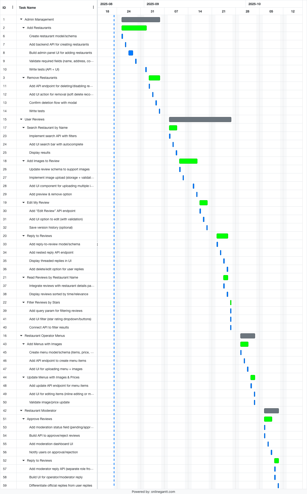

# Requirement Document

### 2. Initial Project Plan (Gantt)

---

## 3. Role & Work Allocations per Person

| Tasks | CB017593 | CB017593 | CB017594 | CB017594 | CB017595 | CB017595 |
| --- | --- | --- | --- | --- | --- | --- |
|     | Pledge(%) | Actual(%) | Pledge(%) | Actual(%) | Pledge(%) | Actual(%) |
| Requirement Specification | 33 |   | 33 |   | 33 |   |
| Design Documents | 33 |   | 33 |   | 33 |   |
| Development | 33 |   | 33 |   | 33 |   |
| Testing/Test Plans | 33 |   | 33 |   | 33 |   |
| Change Management System | 33 |   | 33 |   | 33 |   |
| Version Control System | 33 |   | 33 |   | 33 |   |
| Repository Schema | 33 |   | 33 |   | 33 |   |
| User Guide | 33 |   | 33 |   | 33 |   |
| Project Plan | 33 |   | 33 |   | 33 |   |
| Costing | 33 |   | 33 |   | 33 |   |
| Risk Assessment | 33 |   | 33 |   | 33 |   |
| Meeting Log Book | 33 |   | 33 |   | 33 |   |
| Documentation | 33 |   | 33 |   | 33 |   |
| **Total Contribution (Pledged-Actual)** | 429 |   | 429 |   | 429 |   |

---

## 4. Project Management Approach

### Task Allocation & Tracking

- **Platform**: ClickUp
- **Methodology**: Agile Scrum
- **Sprint Duration**: 2 weeks
- **Task Assignment**: Tasks assigned via ClickUp based on sprint goals and team capacity
- **Tracking**: Status updates, priority tags, and dependencies managed within ClickUp

**Definition of Done (DoD):** A task is considered complete when peer-reviewed, tested, and merged into the `develop` branch.

**Risk-Based Prioritization:** High-risk tasks are prioritized earlier in sprints.

### Project Tracking

- **Dashboards**: Custom ClickUp dashboards for progress visualization
- **Burndown Charts**: Auto-generated per sprint
- **Milestone Reviews**: Held at the end of each sprint

---

## 5. Meeting Format & Schedule

| Meeting Type     | Frequency       | Format          | Purpose                                  |
| ---------------- | --------------- | --------------- | ---------------------------------------- |
| Daily Stand-up   | Daily (15 mins) | Online (Teams)  | Quick updates, blockers, task progress   |
| Sprint Planning  | Bi-weekly       | ClickUp + Teams | Define sprint goals and assign tasks     |
| Sprint Review    | Bi-weekly       | Zoom            | Demo completed work, gather feedback     |
| Retrospective    | Bi-weekly       | Zoom            | Reflect on process, suggest improvements |
| Stakeholder Sync | Monthly         | Hybrid          | Present progress, discuss risks          |

---

## 8. Version Control Mechanism, Responsibility & Policy

- **Tool Used**: GitHub
- **Branching Strategy**:

  - `release`: Stable release
  - `develop`: Dev stage release
  - `pre-develop`: Active development
  - `feature/*`: Individual features
  - `hotfix/*`: Urgent fixes
  - `bugfix/*`: Bug fixes

- **Commit Guidelines**:

  - Use conventional commits (e.g., `feat:`, `fix:`, `docs:`)
  - Link commits to ClickUp tasks using task IDs

- **Review Policy**: At least 2 approvals required before merging into `develop`.
- **Code Style**: Prettier + ESLint for JS/TS, Black for Python.

- **Responsibility**:

  - Lead Developer oversees pull requests and merges
  - All team members must submit PRs for review

- **Backup & Recovery**:
  - GitHub Actions for automated backups
  - Rollback via tagged releases

---

## 9. Change Management System

### Mechanism

- Change requests submitted via ClickUp’s “Change Request” form
- Reviewed during sprint planning or ad-hoc if urgent

### Responsibility

- **Initiation**: Any team member
- **Approval**: Project Manager + relevant stakeholders
- **Execution**: Assigned based on impact and priority

### Policy

- **Minor Changes**: Approved within team, documented in ClickUp
- **Major Changes**: Require stakeholder review, timeline adjustment
- **Impact Assessment**: Each change request must specify effect on _timeline, cost, and quality_
- **Emergency Changes**: PM may fast-track approval if critical
- **Documentation**: All changes logged in ClickUp and reflected in GitHub commits
